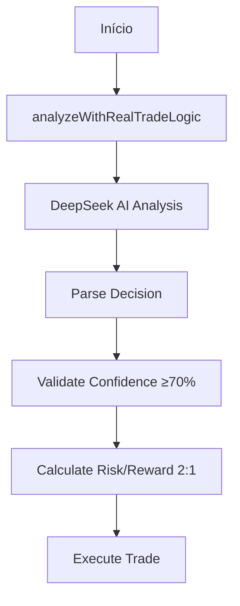
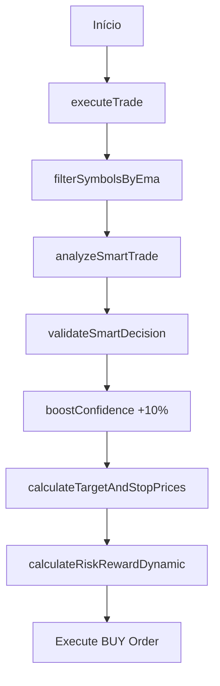
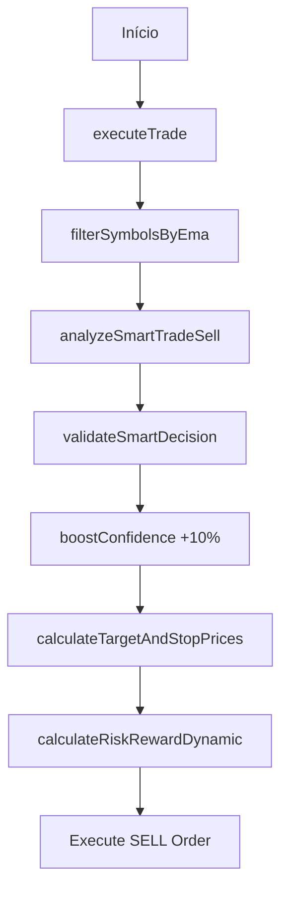
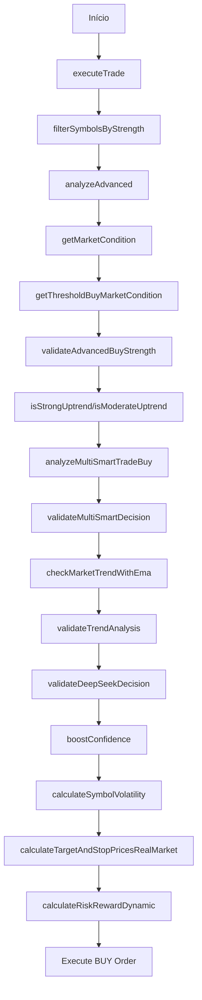
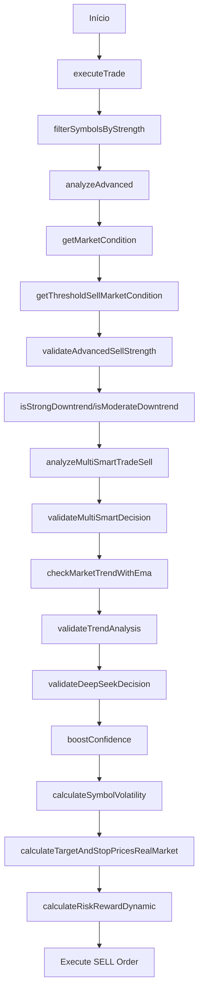
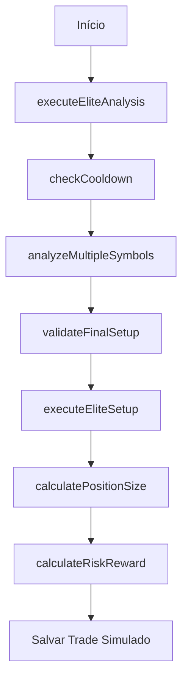

# 🔄 Trading Bot Flows Documentation

Este documento detalha os fluxos de execução dos 6 principais bots de trading do sistema, mostrando a sequência exata de funções chamadas em cada estratégia.

## 📊 Visão Geral dos Fluxos

| Bot | Estratégia | Complexidade | Assertividade | Tipo |
|-----|------------|--------------|---------------|------|
| **Real Trading** | IA Pura | Baixa | 75-80% | BUY/SELL/HOLD |
| **Smart Trading BUY** | EMA + IA | Média | 85-90% | BUY/HOLD |
| **Smart Trading SELL** | EMA + IA | Média | 85-90% | SELL/HOLD |
| **Multi Smart BUY** | Multi-Dimensional | Alta | 92-95% | BUY/HOLD |
| **Multi Smart SELL** | Multi-Dimensional | Alta | 92-95% | SELL/HOLD |
| **Elite Trading** | Ultra-Avançado | Máxima | 95-98% | Simulação |

---

## 🤖 Fluxo 1: Real Trading Bot

**Estratégia**: Análise pura com DeepSeek AI
**Arquivo**: `real-trading-bot.ts`



### Sequência de Funções:
```typescript
1. analyzeWithRealTradeLogic(symbol, marketData)
   ├── DeepSeek AI contextual analysis
   ├── Parse BUY/SELL/HOLD decision
   ├── Extract confidence percentage
   └── Return structured analysis

2. validateConfidence(confidence ≥ 70%)
3. calculateRiskRewardDynamic(confidence)
4. executeTrade() // Se aprovado
```

**Características**:
- ✅ Análise contextual completa
- ✅ Decisões BUY/SELL/HOLD
- ✅ Execução rápida (10-15s)
- ❌ Sem filtros técnicos

---

## 🎯 Fluxo 2: Smart Trading BUY Bot

**Estratégia**: EMA + DeepSeek AI (Long-Only)
**Arquivo**: `smart-trading-bot.ts`



### Sequência de Funções:
```typescript
1. executeTrade()
2. filterSymbolsByEma()
   ├── Check EMA12 > EMA26 (uptrend)
   └── Filter only bullish symbols

3. analyzeSmartTrade() // DeepSeek
   ├── Focus on BULLISH signals only
   ├── Provide BUY or HOLD recommendation
   └── Return confidence score

4. validateSmartDecision()
   ├── Ensure action === 'BUY'
   ├── Validate confidence ≥ 70%
   └── Confirm EMA uptrend

5. boostConfidence()
   ├── +10% when EMA + AI agree
   └── Cap at 95% maximum

6. calculateTargetAndStopPrices()
7. calculateRiskRewardDynamic()
8. Execute BUY order (if approved)
```

**Características**:
- ✅ **APENAS COMPRAS** (Long-Only)
- ✅ Dupla validação (EMA + IA)
- ✅ Boost de confiança +10%
- ✅ Máxima precisão (85-90%)

---

## 📉 Fluxo 3: Smart Trading SELL Bot

**Estratégia**: EMA + DeepSeek AI (Short-Only)
**Arquivo**: `smart-trading-sell-bot.ts`



### Sequência de Funções:
```typescript
1. executeTrade()
2. filterSymbolsByEma()
   ├── Check EMA12 < EMA26 (downtrend)
   └── Filter only bearish symbols

3. analyzeSmartTradeSell() // DeepSeek
   ├── Focus on BEARISH signals only
   ├── Provide SELL or HOLD recommendation
   └── Return confidence score

4. validateSmartDecision()
   ├── Ensure action === 'SELL'
   ├── Validate confidence ≥ 70%
   └── Confirm EMA downtrend

5. boostConfidence()
   ├── +10% when EMA + AI agree
   └── Cap at 95% maximum

6. calculateTargetAndStopPrices()
7. calculateRiskRewardDynamic()
8. Execute SELL order (if approved)
```

**Características**:
- ✅ **APENAS VENDAS** (Short-Only)
- ✅ Dupla validação (EMA + IA)
- ✅ Boost de confiança +10%
- ✅ Máxima precisão (85-90%)

---

## 🚀 Fluxo 4: Multi Smart BUY Bot

**Estratégia**: Análise Multi-Dimensional (Ultra-Avançado BUY)
**Arquivo**: `multi-smart-trading-bot-buy.ts`



### Sequência de Funções:
```typescript
1. executeTrade()
2. filterSymbolsByStrength()
   ├── Multi-timeframe analysis
   ├── Volume and momentum filters
   └── Select strongest symbols

3. analyzeAdvanced()
4. getMarketCondition()
   ├── Analyze overall market state
   └── Return: BULL/BEAR/SIDEWAYS

5. getThresholdBuyMarketCondition()
   ├── Dynamic thresholds by market
   └── Adaptive confidence levels

6. validateAdvancedBuyStrength()
7. isStrongUptrend() / isModerateUptrend()
   ├── Multi-layer trend validation
   └── Strength classification

8. analyzeMultiSmartTradeBuy() // DeepSeek
   ├── Advanced contextual analysis
   ├── Multi-dimensional factors
   └── Ultra-precise BUY signals

9. validateMultiSmartDecision()
10. checkMarketTrendWithEma()
11. validateTrendAnalysis()
12. validateDeepSeekDecision()
13. boostConfidence()
14. calculateSymbolVolatility()
15. calculateTargetAndStopPricesRealMarket()
16. calculateRiskRewardDynamic()
17. Execute BUY order (if approved)
```

**Características**:
- ✅ **APENAS COMPRAS** (Ultra-Conservative)
- ✅ Análise multi-dimensional
- ✅ Thresholds adaptativos
- ✅ Máxima precisão (92-95%)

---

## 📊 Fluxo 5: Multi Smart SELL Bot

**Estratégia**: Análise Multi-Dimensional (Ultra-Avançado SELL)
**Arquivo**: `multi-smart-trading-bot-sell.ts`



### Sequência de Funções:
```typescript
1. executeTrade()
2. filterSymbolsByStrength()
   ├── Multi-timeframe analysis
   ├── Volume and momentum filters
   └── Select weakest symbols

3. analyzeAdvanced()
4. getMarketCondition()
5. getThresholdSellMarketCondition()
   ├── Dynamic thresholds for SELL
   └── Bearish market adaptation

6. validateAdvancedSellStrength()
7. isStrongDowntrend() / isModerateDowntrend()
8. analyzeMultiSmartTradeSell() // DeepSeek
   ├── Advanced bearish analysis
   ├── Multi-dimensional factors
   └── Ultra-precise SELL signals

9. validateMultiSmartDecision()
10. checkMarketTrendWithEma()
11. validateTrendAnalysis()
12. validateDeepSeekDecision()
13. boostConfidence()
14. calculateSymbolVolatility()
15. calculateTargetAndStopPricesRealMarket()
16. calculateRiskRewardDynamic()
17. Execute SELL order (if approved)
```

**Características**:
- ✅ **APENAS VENDAS** (Ultra-Conservative)
- ✅ Análise multi-dimensional
- ✅ Thresholds adaptativos
- ✅ Máxima precisão (92-95%)

---

## 👑 Fluxo 6: Elite Trading Bot Simulator

**Estratégia**: Simulação Ultra-Avançada (Máxima Precisão)
**Arquivo**: `elite-trading-bot-simulator.ts`



### Sequência de Funções:
```typescript
1. executeEliteAnalysis()
   ├── Ultra-advanced market analysis
   └── Elite-level signal detection

2. checkCooldown()
   ├── Verify time between trades
   └── Prevent over-trading

3. analyzeMultipleSymbols()
   ├── Comprehensive multi-asset analysis
   ├── Cross-correlation studies
   └── Market regime detection

4. validateFinalSetup()
   ├── Final validation layer
   ├── Risk assessment
   └── Setup confirmation

5. executeEliteSetup()
   ├── Elite execution logic
   └── Optimal entry timing

6. calculatePositionSize()
   ├── Dynamic position sizing
   └── Risk-adjusted allocation

7. calculateRiskReward()
   ├── Advanced R/R calculation
   └── Multi-scenario analysis

8. // Salvar trade simulado
   ├── Save to elite trades file
   ├── Track performance metrics
   └── Generate detailed logs
```

**Características**:
- ✅ **SIMULAÇÃO APENAS** (Zero Risco)
- ✅ Análise ultra-avançada
- ✅ Máxima precisão (95-98%)
- ✅ Elite-level algorithms

---

## 📈 Comparativo de Complexidade

| Fluxo | Funções | Validações | Tempo | Precisão | Uso |
|-------|---------|------------|-------|----------|-----|
| **Real Trading** | 4 | 2 | 10-15s | 75-80% | Rápido |
| **Smart BUY** | 8 | 4 | 15-25s | 85-90% | Equilibrado |
| **Smart SELL** | 8 | 4 | 15-25s | 85-90% | Equilibrado |
| **Multi Smart BUY** | 17 | 8 | 20-30s | 92-95% | Conservador |
| **Multi Smart SELL** | 17 | 8 | 20-30s | 92-95% | Conservador |
| **Elite Simulator** | 8 | 6 | 25-35s | 95-98% | Ultra-Elite |

---

## 🎯 Quando Usar Cada Fluxo

### **Real Trading** - Velocidade
- Mercado em movimento rápido
- Precisa de execução imediata
- Aceita menor precisão por velocidade

### **Smart BUY/SELL** - Equilíbrio
- Mercado em tendência clara
- Quer dupla validação
- Busca equilíbrio precisão/velocidade

### **Multi Smart BUY/SELL** - Precisão
- Mercado complexo/volátil
- Quer máxima precisão
- Aceita menos trades por qualidade

### **Elite Simulator** - Pesquisa
- Desenvolvimento de estratégias
- Backtesting avançado
- Análise de performance

---

## 🔧 Configurações por Fluxo

```typescript
// Real Trading
MIN_CONFIDENCE: 70%
RISK_LEVELS: [0.5%, 1.0%, 1.5%]
TIMEFRAME: '1h'

// Smart Trading
MIN_CONFIDENCE: 75%
EMA_PERIODS: [12, 26]
BOOST_CONFIDENCE: +10%

// Multi Smart Trading
MIN_CONFIDENCE: 80%
MULTI_TIMEFRAMES: ['15m', '1h', '4h']
ADAPTIVE_THRESHOLDS: true

// Elite Simulator
MIN_CONFIDENCE: 85%
ELITE_ALGORITHMS: true
CROSS_CORRELATION: true
```

---

**⚡ Cada fluxo é otimizado para diferentes cenários de mercado e perfis de risco. Escolha o fluxo adequado baseado em suas necessidades de velocidade vs precisão.**